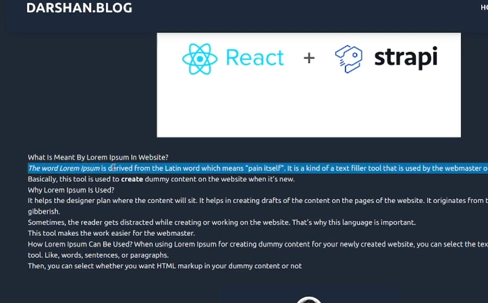
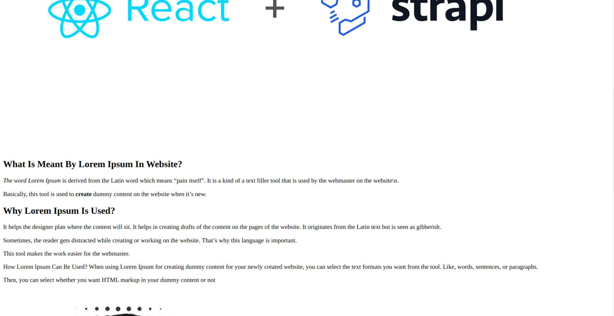

## Troubleshooting Rendring Issue with Tailwind in React App using

Are you encountering issues with rendering Markdown content in your React app that uses Tailwind CSS? Markdown is a popular choice for creating formatted text, but it can sometimes clash with the styling provided by Tailwind CSS. In this blog post, I will mention the problem and also provide solutions to ensure your Markdown content renders beautifully in your React application.

### Problem
The Markdown content renders as it should be for bold and italic  text but it doesn't renders as it should be for headings or any other formats such as codeblocks, quotes etc.



But after disabling Tailwind CSS, I reloaded and checked the app once more, and to my delight, I found that the markdown was successfully rendered as follows:



### Solution
#### Tailwind CSS Typography Plugin:
One of the recommended solutions is to use the Tailwind CSS Typography plugin. This plugin enhances Tailwind CSS's typography styles and ensures that your Markdown content looks consistent with your application's design.

To set up the Tailwind CSS Typography plugin, follow these steps:
- Install the plugin with 
```bash
npm install -D @tailwindcss/typography.
```
- Add it to your Tailwind CSS configuration in the plugins section.
```bash
module.exports = {
  // ...
  plugins: [
  
    require('@tailwindcss/typography'),
    
    // ...
  ],
};

```

Now, you can apply the prose class to your Markdown content. The Typography plugin will handle the styling, making your text look better while still allowing you to customize it further if needed.

```bash
<ReactMarkdown className="prose">
  {/* Your Markdown content here */}
</ReactMarkdown>

```

Futther more if you want to style your Markdown content then you can add some porse styles in the React Markdown component as:

```bash
 <ReactMarkdown className="prose prose-headings:text-white prose-p:text-white">                      
  {/*  Your Markdwon content */}
  </ReactMarkdown>
```

Here  **_max-w-full_,  _prose-headings:text-white_,  _prose-p:text-white_** etc. are styling used for markdwon content.

By following these troubleshooting tips, you can ensure that your Markdown content renders correctly and harmoniously with Tailwind CSS in your React applications.