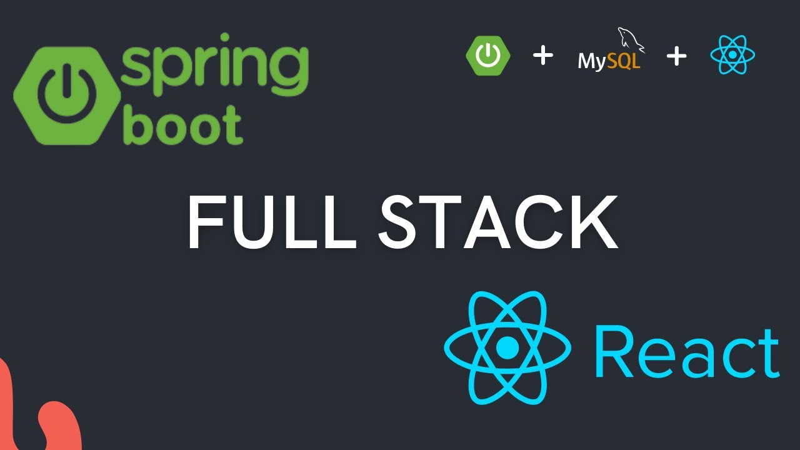

## Java-React Fullstack Developer Pathway

In the ever-evolving landscape of web development, fullstack developers play a crucial role in creating dynamic and interactive web applications. If you're aspiring to be a proficient fullstack developer, this comprehensive pathway will guide you through the necessary steps to master both Java with a focus on Spring Boot and React, two powerful technologies used in building modern web applications.

### Why Become a Fullstack Developer?

A fullstack developer is essentially a "jack of all trades" in the world of web development. They possess the skills to work on both the frontend and backend of web applications, making them highly versatile professionals. As a fullstack developer, you can handle a wide range of tasks, from designing the user interface to managing the server and database. This not only broadens your job opportunities but also provides you with a deeper understanding of the entire development process.

### The Java-React Pathway

Our pathway is designed to take you from a beginner to an adept fullstack developer, focusing on Java with an emphasis on Spring Boot and React technologies. Here's a breakdown of the key steps in this learning journey:

#### Step 1: Mastering Java with Spring Boot

Java is a robust, object-oriented programming language that's widely used in backend development. Start your journey by learning the fundamentals of Java with a special emphasis on Spring Boot. This includes variables, data types, control structures, and object-oriented programming principles.

#### Step 2: Backend Development with Java and Spring Boot

Once you're comfortable with Java and Spring Boot, dive into backend development. Explore topics like handling HTTP requests, connecting to databases, and building RESTful APIs. Gain hands-on experience in creating a backend for web applications.

#### Step 3: Introduction to React

With a solid backend foundation, it's time to shift your focus to the frontend. React is a popular JavaScript library for building user interfaces. Learn the basics of React, including components, props, and state management.

#### Step 4: Building Dynamic Frontend

Take your React skills to the next level by building dynamic and interactive user interfaces. Explore advanced concepts like routing, form handling, and integrating third-party libraries to enhance your web applications.

#### Step 5: Fullstack Integration

Now that you're proficient in both Java (with Spring Boot) and React, it's time to bring it all together. Learn how to connect your frontend React applications with your Java backend (powered by Spring Boot) to create a seamless fullstack application.

#### Step 6: Real-world Projects

To solidify your skills, work on real-world projects that simulate the challenges you'll encounter as a fullstack developer. Collaborate with your peers, and create web applications from start to finish.

#### Step 7: Continuous Learning

Web development is a rapidly changing field. Stay up to date with the latest trends and technologies. Consider learning additional tools and frameworks to further enhance your skill set.

#### Conclusion

Becoming a Java-React fullstack developer, with a focus on Spring Boot, is an exciting and rewarding journey. With this pathway, you have a structured plan to guide you from the basics of Java to building dynamic web applications with React. Whether you aim to work as a freelancer, join a tech company, or launch your projects, the skills you acquire on this pathway will open doors to various opportunities in the world of web development. Start your journey today and embark on a career in fullstack development!