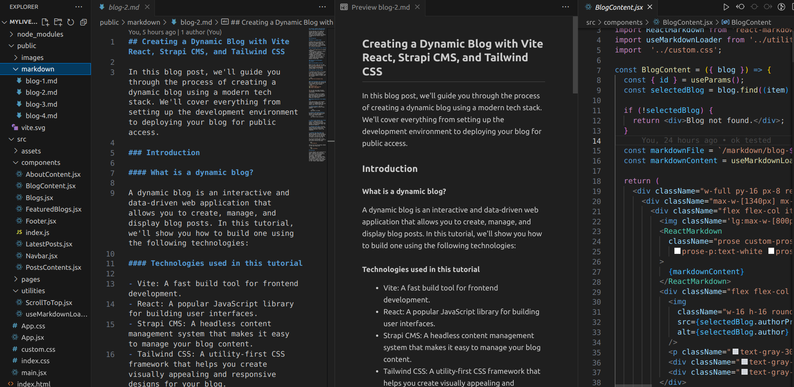

## Crafting a Serverless, Database-Free Dynamic Blog: Markdown Magic with React

In my quest for a truly hassle-free and serverless dynamic blog, I employed a unique strategy, eliminating the need for databases, backend technologies, and the complications of deployment and paid hosting.

### Introduction

After facing hosting and deployment challenges with my previous blog, which was built using React, Vite, Tailwind CSS, and Strapi CMS, I sought a simpler approach.

#### Here's how I meticulously developed this serverless, frontend-driven dynamic blog:

**1. Markdown Files as Blog Posts**

Instead of relying on a traditional backend and database, I turned to markdown files, which were conveniently placed inside the public directory of my project. I used the **_useMarkdownLoader_** custom hook to load each markdown file and pass its content to the **_BlogContent_** component. This approach allowed each markdown file to serve as an individual blog post, containing the content, images, and metadata.



**2. Frontend Rendering**

The core of my dynamic blog resides in the frontend. I meticulously designed a React application to render the content from these markdown files. To ensure compatibility with hosting platforms like Vercel, the markdown files had to be located in the root directory of the public folder. Additionally, any image assets required for the markdown text within the blog content were stored inside the public folder of the project.
Here's a code snippet example of the **_useMarkdownLoader_** custom hook:

```jsx
// useMarkdownLoader.js
import { useEffect, useState } from 'react';

const useMarkdownLoader = (markdownFile) => {
  const [markdownContent, setMarkdownContent] = useState('');

  useEffect(() => {
    const fetchMarkdown = async () => {
      try {
        const response = await fetch(markdownFile);
        const text = await response.text();
        setMarkdownContent(text);
      } catch (error) {
        console.error(error);
      }
    };

    fetchMarkdown();
  }, [markdownFile]);

  return markdownContent;
};

export default useMarkdownLoader; 
```
And here's how the **_useMarkdownLoader_** is integrated into the **_BlogContent_** component:

```jsx
import { useParams } from 'react-router-dom';
import ReactMarkdown from 'react-markdown';
import useMarkdownLoader from '../utilities/useMarkdownLoader';
import '../custom.css';

const BlogContent = ({ blog }) => {
  // ... (previous code)

  // Using the useMarkdownLoader to load the markdown content
  const markdownFile = `/markdown/blog-${id}.md`;
  const markdownContent = useMarkdownLoader(markdownFile);

  return (
    // ... (previous code)
  );
};

export default BlogContent;

```
Check the source [here](https://github.com/darshanbajgain/myliveblog) in my Github.

**3. No CMS or Backend Technology**

By eliminating the use of a CMS or backend technology, I streamlined the development process. This resulted in a lighter and more efficient blog system.

**4. Database-Free**

The entire blog operates without a database. Instead, it leverages markdown files for content storage and retrieval.

### Conclusion

This innovative solution not only overcame the hosting and deployment challenges but also offers a practical and easy-to-maintain approach for creating a dynamic blog with minimal dependencies. The markdown-powered React frontend brings content to life while eliminating the need for a complex backend, making it an excellent choice for bloggers seeking a simplified, serverless approach.

